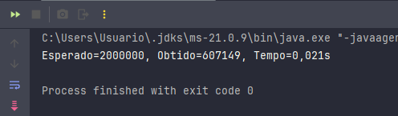
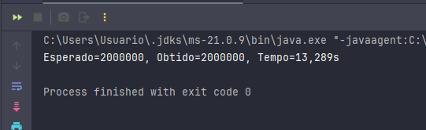
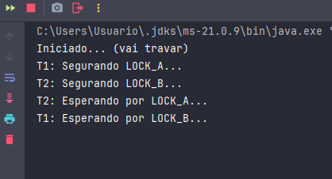
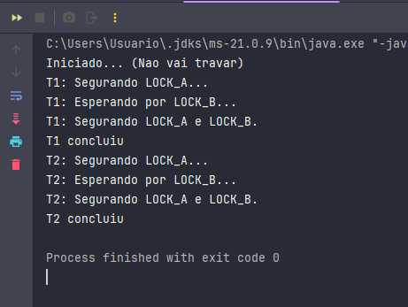

# TDE3 - Atividade FInal
**Disciplina:** Performance em Sistemas Ciberfísicos

**Professor:** Andrey Cabral Meira

**Integrantes:**
- Adrian Antônio de Souza Gomes;
- Bruna da Silva Carnelossi;
- João Pedro de Souza Quintiliano da Silva;
- Lucas Azzolin Haubmann.

**Link do Vídeo da Atividade:** 

----
## Parte 1 - Jantar dos Filósofos 🍝🤔🍴
### Resumo:

O problema do Jantar dos Filósofos se concentra na modelagem N = 5, onde 5 filósofos alternam entre pensar e comer. Cada filósofo precisa de dois garfos (um à esquerda e outro à direita) para comer, porém não há garfos suficientes para todos os filósofos comerem ao mesmo tempo, existindo somente 1 garfo entre cada filósofo.

Dessa forma, os filósofos seguem a seguinte instrução: *"pegar primeiro o garfo da esquerda e depois o da direita"*, existindo dessa forma a possibilidade de deadlock, onde cada filósofo pega seu garfo esquerdo e aguarda o direito, terminando com nenhum progridindo, pois cada filósofo segura o primeiro garfo e aguarda pelo segundo que está na mão de outro filósofo.

Portanto o ***OBJETIVO*** da atividade consiste em:

- Simular o problema com N = 5, registrando estados: **PENSANDO**, **COM_FOME** e **COMENDO**.
- Demonstrar por que as instruções "simples" podem entrar em impasse (deadlock).
- Projetar e justificar um protocolo que evite deadlock, apresentando pseudocódigo e explicando qual condição de *Coffman* é negada.

----
### Conhecendo o problema:

- Cada filósofo repete: pensar → ficar com fome → tentar pegar dois garfos → comer → soltar garfos.
- Os garfos são recursos compartilhados entre filósofos vizinhos.
- Com instruções simétricas (todos tentam o mesmo, ao mesmo tempo), pode haver um ciclo de espera no qual cada filósofo segura um recurso e espera pelo próximo — formando uma **Espera Circular**.
----
### Por que o impasse surge?

O impasse (deadlock) aparece quando as quatro condições de *Coffman* ocorrem simultaneamente:

- **Exclusão mútua:** garfos não podem ser compartilhados enquanto usados.
- **Manter e esperar (hold and wait):**  filósofos pegam um garfo e aguardam pelo outro.
- **Não preempção:** um garfo não pode ser forçosamente retirado de um filósofo que já o segura.
- **Espera circular:** existe um ciclo de dependências (A espera por B, B por C, ..., Z por A).

----
### Solução Proposta (hierarquia de recursos) - ID estabelecido:

**Estratégia:** impor uma ordem total sobre recursos (garfos) e exigir que todo filósofo adquira sempre primeiro o garfo de menor índice e depois o de maior índice, quebrando assim uma das condições de *Coffman*, a **Espera Circular**.

Desta fora, cada garfo recebe um índice 0..N-1.
→  Para o filósofo p, deve-se identificar left = garfo(p) e right = garfo((p+1) mod N).
→  Então deve-se calcular primeiro = min(left, right) e segundo = max(left, right).
→  Dessa forma, cada filosófo vai sempre pedir o primeiro antes de pedir segundo (sempre pegando antes o garfo com índice menor - o da esquerda). Liberando assim, sempre em ordem inversa (ou em qualquer ordem após o uso).

### [| | Ver Pseudo-Código do problema do Jantar do Filósofos - Resolvido](atividades/JantarDosFilosofos/PseudoCódigo.text)

----
### Conclusão do problema:
A espera circular é eliminada porque toda aquisição de recursos respeita a mesma ordem global. Não existe sequência de filósofos A → B → C →...→ A, onde cada um detém um recurso necessário para o próximo sem violar a ordem; portanto não é possível haver ciclo.
Essa mudança pequena nas regras locais evita a condição crítica (espera circular) que permite deadlock, recuperando progresso coletivo sem sacrificar a exclusão mútua.

OBS: A ordem global garante ausência de ciclos de espera, mas não garante automaticamente ausência de inanição (starvation - estado de fome)

----
## Parte 2 - Contador Concorrente com e sem Semáforo 🚦🚗

O experimento teve como **objetivo** comparar o comportamento de um contador compartilhado entre múltiplas threads em dois cenários: sem sincronização e utilizando um semáforo binário.

---
### Execução 1 - Sem Semáforo

* Esperado: 2.000.000
* Obtido: 607.149
* Tempo: 0,021s

Sem qualquer mecanismo de sincronização, o programa sofre uma condição de corrida, pois várias threads atualizam simultaneamente o contador usando a operação count++, que não é atômica. Dessa forma, incrementos são perdidos, resultando em um valor final incorreto. Apesar disso, o tempo de execução é extremamente baixo, pois não há bloqueios nem espera entre threads, produzindo um throughput muito alto, mas com dados inconsistentes.

### Execução 2 - Com Semáforo

* Esperado: 2.000.000
* Obtido: 2.000.000
* Tempo: 13,289s
----
### Análise dos Trade-offs

O experimento evidencia um trade-off clássico em programação concorrente:

1. Sem sincronização

2. Com semáforo

---
### Conclusão

O experimento demonstra a importância de usar sincronização corretamente e de forma estratégica. Sincronizar garante consistência, mas sempre envolve um trade-off com desempenho. Um semáforo aplicado corretamente produz um valor final exato, mas com throughput reduzido. Porém, quando mal aplicado, ele elimina as vantagens do paralelismo sem resolver o problema da concorrência.

O estudo reforça que mecanismos de sincronização devem ser usados com cuidado, protegendo apenas o necessário e garantindo que toda a seção crítica esteja dentro da região protegida.

----
## Parte 3 - DeadLock 🅰️🅱️🔒

O objetivo desta atividade é demonstrar um deadlock, explicar por que ele ocorre com base nas Condições de Coffman, e implementar uma solução que elimine o problema, preferencialmente aplicando uma hierarquia de recursos (ordenação global de locks).

Deadlock é uma situação em que duas ou mais threads ficam bloqueadas para sempre, esperando uma pela outra, impedindo o progresso da aplicação. Esse tipo de problema é comum em sistemas que utilizam sincronização com synchronized, locks ou recursos compartilhados.

No primeiro modelo [DeadlockDemo.java](atividades/AtividadeDeadlock/DeadlockDemo.java) temos:

A Thread 1 (T1):
- pega LOCK_A
- tenta pegar LOCK_B

 A Thread 2 (T2):
- pega LOCK_B
- tenta pegar LOCK_A

Nesse resultado, cada thread possui um lock e está esperando indefinidamente pelo lock da outra.
Isso é exatamente a definição de deadlock.
----
### Relação com as Condições de Coffman

Assim como já foi descrito neste relatório, segundo Coffman, um deadlock só ocorre quando quatro condições acontecem simultaneamente.

A implementação apresentada anteriormente satisfaz todas elas:

1. **Exclusão Mútua:** Cada lock (LOCK_A e LOCK_B) só pode ser mantido por uma thread de cada vez.
Sem essa condição não há deadlock.

2. **Manter e Esperar (Hold and Wait):** Cada thread segura um lock enquanto espera por outro. - T1 segura A e espera B, enquanto T2 segura B e espera A.

3. **Não Preempção:** Uma thread não pode ter o lock tomado à força; ela só libera voluntariamente.

4. **Espera Circular:** É aqui que se encontra o ponto crucial pois:

**T1** → precisa de **B** enquanto segura **A**

**T2** → precisa de **A** enquanto segura **B**

Formando um ciclo: T1 esperando T2 e T2 esperando T1, o programa continua rodando mas trava pois não consegue progredir.

---

### Solução Implementada:
Para eliminar o deadlock, foi aplicada uma solução clássica ([DeaklockCorrigido.java](atividades/AtividadeDeadlock/DeadlockCorrigido.java)): hierarquia de recursos.
Isso significa que **todas as threads passaram a adquirir os locks sempre na mesma ordem**.

Antes:

- T1 pegava LOCK_A → depois LOCK_B
- T2 pegava LOCK_B → depois LOCK_A 

Criando assim a espera circular (deadlock).

Depois (solução):
T1 e T2 passaram a pegar *sempre* na ordem:
- LOCK_A  →  LOCK_B

Fazendo com que não haja mais a possibilidade de acontecer:

* Thread 1 espera LOCK_B enquanto segura LOCK_A
* Thread 2 espera LOCK_A enquanto segura LOCK_B

Ou seja: ***sem ordem*** sempre pode existir ciclo de espera das trheads, enquanto que ***com ordem*** não existe este ciclo, portanto não existe ***deadlock***.

Isso quebra uma das *Condições de Coffman*: espera circular.

---
### Conclusão:

O deadlock ocorreu porque as threads adquiriram os locks em ordens diferentes, provocando uma espera circular, exatamente como descrito no problema clássico dos filósofos.

A solução aplicada segue o padrão amplamente utilizado em sistemas concorrentes: hierarquia de recursos. Ao obrigar todas as threads a adquirir os locks na mesma ordem, eliminamos a possibilidade de formar um ciclo de dependência, interrompendo uma das *condições de Coffman* e evitando o deadlock de forma definitiva.

